<!-- Animated Header -->
<div align="center">
  
</div>

<!-- Badges & Links -->
<div align="center">
  
  [](https://github.com/suhaibbinyounis)
  [](https://twitter.com/suhaibbinyounis)
  [](https://suhaibbinyounis.com)
  [](https://notes.suhaib.in)
  [](https://apps.suhaib.in)
  
</div>

<br/>

<!-- Quick Intro -->
<div align="center">
  <samp>
    「 Full-stack engineer who architects systems, reviews code, debugs production, and ships what matters. 」
  </samp>
</div>

<br/>

<!-- About Section -->
## 🧑‍💻 About Me

```javascript
const suhaib = {
    pronouns: "he" | "him",
    location: "building the future, one commit at a time",
    currentFocus: ["AI/LLM Applications", "Browser Automation", "RAG Pipelines"],
    askMeAbout: ["web dev", "AI agents", "system design", "debugging production fires"],
    funFact: "I believe every problem has a stack to solve it—I just need to find it."
};
```

<br/>

<!-- Featured Projects -->
## 🔥 Featured Projects

<div align="center">
<table>
<tr>
<td width="50%">

<h3 align="center">LLM Web Agent</h3>
<div align="center">  
<a href="https://github.com/suhaibbinyounis/llm-web-agent" target="_blank">

</a>
<br/>
<p>
<strong>Research-driven browser automation</strong> combining pattern-based element resolution with LLM intelligence for robust, fast web interactions.
</p>
</div>
</td>

<td width="50%">

<h3 align="center">GitHub Copilot API Gateway</h3>
<div align="center">
<a href="https://github.com/suhaibbinyounis/github-copilot-api-vscode" target="_blank">

</a>
<br/>
<p>
<strong>Unlock the full power of GitHub Copilot.</strong> A local proxy that lets you use your subscription with Cursor, LangChain, and any OpenAI-compatible tool.
</p>
</div>
</td>
</tr>
</table>
</div>

<br/>

<!-- Tech Stack -->
## 🛠️ Tech Stack

<div align="center">

### Languages


### Frameworks & Libraries


### AI & ML


### Tools & Platforms


</div>

<br/>

<!-- GitHub Stats -->
## 📊 GitHub Stats

<div align="center">
<table>
<tr>
<td width="50%">

</td>
<td width="50%">

</td>
</tr>
</table>
</div>

<div align="center">

</div>

<br/>

<!-- Trophy Case -->
<div align="center">

</div>

<br/>

<!-- Contribution Snake -->
## 🐍 Contribution Snake

<picture>
  <source media="(prefers-color-scheme: dark)" srcset="https://raw.githubusercontent.com/suhaibbinyounis/suhaibbinyounis/output/github-snake-dark.svg" />
  <source media="(prefers-color-scheme: light)" srcset="https://raw.githubusercontent.com/suhaibbinyounis/suhaibbinyounis/output/github-snake.svg" />
  
</picture>

<br/>

<!-- Activity Graph -->
## 📈 Contribution Graph

<div align="center">

</div>

<br/>

<!-- Apps & Projects -->
## 📱 Apps & Projects

A collection of web applications and tools I've built. All free to use.

| App | Category | Description |
| :--- | :--- | :--- |
| **[Echo: API Client](https://testapis.suhaib.in)** | ⚡ Productivity | Test APIs instantly, no signup needed. |
| **[Al-Quran Reader](https://quran.suhaib.in)** | 📖 Education | Read and study the Holy Quran with translation. |
| **[Book Nook](https://books.suhaib.in)** | 📚 Education | Explore 70,000+ classic books. |
| **[StreamFlix](https://anime.suhaib.in/v1/movie.html)** | 🎬 Entertainment | Watch movies, dramas, and shows for free. |
| **[P2P Transfer](https://transfer.suhaib.in)** | 🛠️ Utilities | Secure peer-to-peer file sharing directly between devices. |
| **[LonelyBird](https://lonelybird-fb0bc.web.app/)** | 💬 Social | 100% free anonymous chat that actually works. |

👉 **[View All Apps (10+)](https://apps.suhaib.in)**

<br/>

<!-- Knowledge Base -->
## 🧠 Knowledge Base

Deep dives into technology, programming, and science.

<div align="center">

[](https://notes.suhaib.in/docs/tech/llms/)
[](https://notes.suhaib.in/docs/tech/programming/)
[](https://notes.suhaib.in/docs/code/)
[](https://notes.suhaib.in/docs/tech/design/)
[](https://notes.suhaib.in/docs/tech/physics/)

</div>

<br/>

<!-- Metrics -->
## 📉 Detailed Metrics

<div align="center">

</div>

<br/>

<!-- Footer -->
<div align="center">
  
---


<samp>
  <i>"Give me a problem, I'll find the stack to solve it."</i>
  <br/><br/>
  <a href="https://suhaibbinyounis.com">Website</a> • 
  <a href="mailto:vscode@suhaib.in">Email</a> • 
  <a href="https://twitter.com/suhaibbinyounis">Twitter</a>
</samp>

</div>
