<!-- Animated Header -->

  

<!-- Badges & Links -->

  
  
  
  
  
  

 

<!-- Quick Intro -->

  <samp>
    「 Full-stack engineer who architects systems, reviews code, debugs production, and ships what matters. 」
  </samp>

 

<!-- The Message Section -->
## The Message

Gratitude overwhelms me—for life, for the people who stand beside me, for the quiet moments that remind me of what truly matters. None of this holds meaning without the ones who make it whole. I could never deserve the love I’ve been given, the kindness, the depth of connection. It humbles me. It reminds me—this journey was never meant to be walked alone.

I no longer believe in standing alone. This world was never built on solitary victories, but on hands reaching out, lifting each other—often without words, often in silence. We are bound not just by ambition, but by something far greater: shared burdens, quiet resilience, the unspoken promise that when the weight becomes too much, someone will be there to help carry it.

Aspire to give more than you take. Not for praise, not for recognition, but for the quiet ways you shape the lives around you. And when life presses down, when it feels heavy beyond words—pause. Sit with those who remind you of what’s real. Let their presence anchor you to the things that last.

Because when the chase fades, when illusions crumble, when everything falls apart—one thing remains. Love. Real connection. The people who refuse to let go.

**Hold onto them.**

 

<!-- Featured Projects -->
## 🔥 Featured Projects

<table>
<tr>
<td width="50%">

<h3 align="center">LLM Web Agent</h3>

  

 

<strong>Research-driven browser automation</strong> combining pattern-based element resolution with LLM intelligence for robust, fast web interactions.

</td>

<td width="50%">

<h3 align="center">GitHub Copilot API Gateway</h3>

 

<strong>Unlock the full power of GitHub Copilot.</strong> A local proxy that lets you use your subscription with Cursor, LangChain, and any OpenAI-compatible tool.

</td>
</tr>
</table>

 

<!-- Footer -->

  
---

<samp>
  <i>"Give me a problem, I'll find the stack to solve it."</i>
    
  <a href="https://suhaibbinyounis.com">Website</a> • 
  <a href="mailto:vscode@suhaib.in">Email</a> • 
  <a href="https://twitter.com/suhaibbinyounis">Twitter</a>
</samp>

